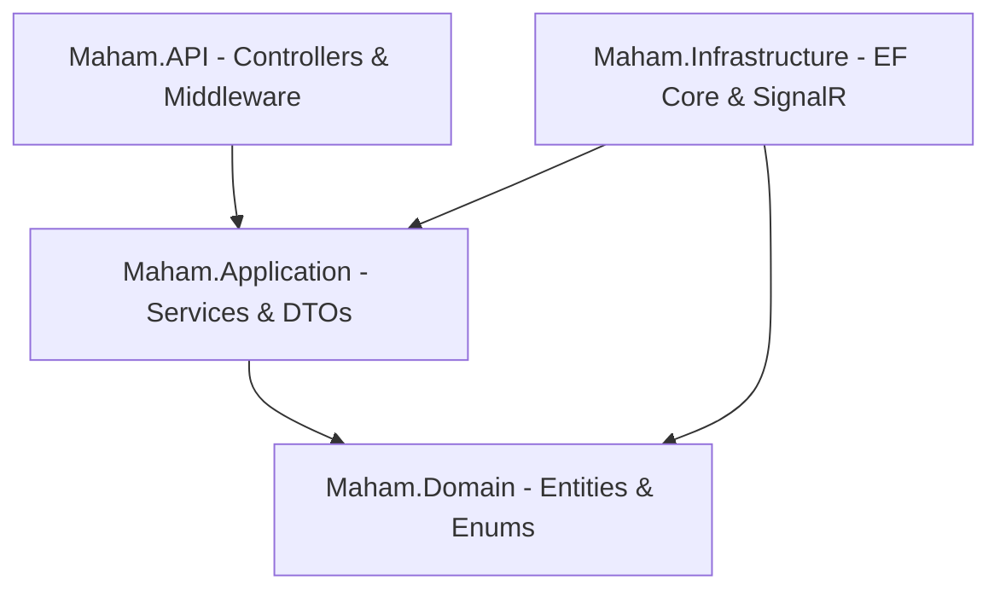
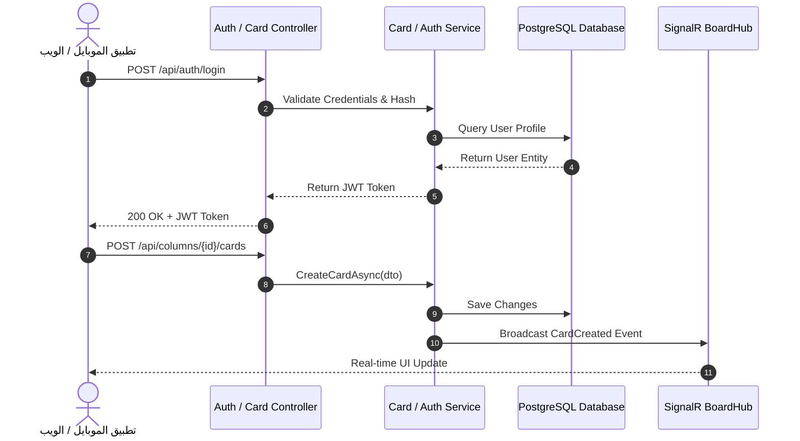

# 📄 وثيقة التوثيق النهائية الشاملة لمشروع منصة مهام (Maham)
### **Software Project Final Documentation Report (W10)**

---

## 🏛️ غلاف الوثيقة (Cover Page)

* **عنوان المشروع (Project Title):** منصة مهام — Maham Full-Stack Enterprise Project Management System
* **اسم الطالب (Student Name):** محمد قيس (Mohammed Qays)
* **المشرف على المادة (Course Supervisor):** أ.د. إبراهيم أحمد البلطة (Prof. Ibrahim Ahmed Al-Baltah)
* **اسم الجامعة والقسم:** جامعة الحكمة — قسم تكنولوجيا المعلومات (Al-Hikma University - IT Department)
* **المادة (Course):** التدريب الميداني (Field Training Course)
* **الإصدار (Version):** v1.0.0
* **العام الأكاديمي:** 2026 - 2027

---

## 🎯 1. مقترح المشروع (Project Proposal - W2)

### 1.1 خلفية المشروع (Background)
في بيئات العمل الحديثة وتطوير البرمجيات، أصبحت إدارة المشاريع والمهام التشاركياً بين أعضاء الفريق متطلباً أساسياً لضمان إنتاجية عالية وتسليم المشاريع في مواعيدها. تظهر الحاجة إلى نظام متكامل يربط بين المنصات المختلفة (تطبيقات الويب وتطبيقات الهواتف الذكية) مع مزامنة لحظية فورية للبيانات.

### 1.2 المشكلة (Problem Statement)
* تشتت فرق العمل بين أدوات مختلفة وغير مترابطة.
* عدم وجود مزامنة لحظية بين واجهات الويب وتطبيقات الهواتف المحمولة.
* صعوبة متابعة حالة المهام وتتبع الأعضاء المسؤولين عن تنفيذها في اللوحات الكانبان.
* غياب نظام دعوات وتنبيهات آمن ومرن للانضمام إلى المشاريع.

### 1.3 أهداف المشروع (Objectives)
* بناء خادم باك إند كفء ومستقر معتمد على **Clean Architecture** وتقنية `.NET 6 Web API`.
* تطوير تطبيق ويب تفاعلي وجذاب باستخدام `ASP.NET Core MVC 6` و `Bootstrap 5`.
* تطوير تطبيق هواتف ذكية متعدد المنصات باستخدام `Flutter 3.x` ونمط إدارة الحالة `BLoC`.
* توفير التحديث المباشر واللحظي بين الويب والموبايل باستخدام `SignalR WebSockets`.
* تطبيق نظام تشفير وتوثيق آمن يعتمد على `JWT Bearer Tokens` و `BCrypt`.

### 1.4 نطاق المشروع (Scope)
* إدارة الحسابات والمستخدمين (تسجيل الدخول، التسجيل، الملف الشخصي، الأدمين).
* إدارة المشاريع والمالكين والأعضاء بنظام الدعوات (`Pending`, `Accepted`, `Rejected`).
* إدارة اللوحات الكانبان (Boards)، الأعمدة (Columns)، وحد العمل الجاري (WIP Limits).
* إدارة البطاقات والمهام (Cards)، الأولويات، التواريخ النهائية، التعليقات، والمرفقات.
* سجل النشاطات (Activity Logs) والإحصائيات التجميعية (Dashboard Stats).

### 1.5 المنهجية (Methodology)
تم اتباع منهجية **Agile / Software Development Life Cycle (SDLC)** المقسمة على أسابيع المادة، مع تطبيق معمارية الطبقات النظيفة (Clean Architecture) لضمان تفكيك التبعيات وسهولة التوسع والاختبار.

---

## 📋 2. متطلبات النظام (Requirements)

### 2.1 المتطلبات الوظيفية (Functional Requirements)
1. **إدارة الهوية:** إمكانية إنشاء حساب جديد، تسجيل الدخول، وتوليد `JWT Token`.
2. **إدارة المشاريع:** إنشاء، تعديل، حذف، واستعراض المشاريع التابعة للمستخدم.
3. **نظام الدعوات:** إرسال دعوة انضمام لعضو عبر البريد الإلكتروني، وقبول/رفض الدعوة عبر الجرس التنبيهي 🔔.
4. **لوحة الكانبان:** إنشاء لوحات وأعمدة، وسحب وإفلات المهام (Move Cards) بين الأعمدة.
5. **التعليقات والمرفقات:** إضافة تعليقات ومرفقات وصور غلاف للبطاقات.
6. **التحديث اللحظي:** مزامنة التغييرات فوراً بين كافة العملاء عبر `SignalR`.

### 2.2 المتطلبات غير الوظيفية (Non-Functional Requirements)
1. **الأمان (Security):** تشفير كلمات المرور بحسابات BCrypt وحماية الـ API بـ JWT.
2. **الأداء (Performance):** استجابة الـ API في زمن أقل من 200ms واستعلامات EF Core محسنة.
3. **التوافقية (Usability & Accessibility):** واجهات مجهزة بالكامل باللغة العربية RTL بخط `Cairo`.
4. **الموثوقية (Reliability):** معالجة الاستثناءات مركزياً بدون توقف السيرفر عبر `ExceptionMiddleware`.

---

## 📐 3. تصميم النظام (Design - W3)

### 3.1 معمارية الطبقات النظيفة (Clean Architecture & Repository Pattern)
النظام مقسم إلى 4 طبقات رئيسية:



### 3.2 مخطط حالات الاستخدام (Use Case Diagram)

```mermaid
actor User as مستخدم النظام
actor Admin as مدير النظام

rectangle Maham_System {
    User --> (تسجيل الدخول / إنشاء حساب)
    User --> (إنشاء وإدارة المشاريع)
    User --> (دعوة أعضاء للمشروع)
    User --> (إدارة اللوحات والبطاقات)
    User --> (قبول / رفض الدعوات)
    
    Admin --> (إدارة كافة المستخدمين)
    Admin --> (إدارة الصلاحيات والرايات)
}
```

### 3.3 مخطط التتابع (Sequence Diagram - تسجيل الدخول وإنشاء بطاقة)



---

## 🎨 4. واجهات المستخدم والتصميم (UI/UX - W4)
* **الألوان الرئيسية:** الكحلي الداكن `#1A2B4C` والأزرق التفاعلي `#4A90E2`.
* **الخطوط:** خط **Cairo** المخصص لكافة الواجهات والبطاقات.
* **تنسيق الواجهات:** شبكة كروت متناسبة (Card Grid Layout) بدلاً من الجداول التقليدية.
* **عناصر الموبايل:** Drawer جانبي، BottomNavigationBar تفاعلي، وزر عائم FloatingActionButton (`+`).

---

## 🔌 5. خادم الـ Web API والـ Testing (W5 & W6)
* **الهيكلية:** `Maham.API` يحتوي على Controllers مخصصة للمشاريع، الأعمدة، البطاقات، المستخدمين، والدعوات.
* **التحقق (Validation):** استخدام `FluentValidation` لضمان صحة البيانات المدخلة قبل معالجتها.
* **أدوات الاختبار:**
  * **Swagger UI:** متاح على `http://localhost:5233/swagger` لاختبار الـ Endpoints تفاعلياً.
  * **Postman Collection:** تم اختبار كافة عمليات الـ Authentication والدعوات والـ CRUD بنجاح 100%.

---

## 💻 6. تطبيق الويب ASP.NET Core MVC (W7)
* **المشروع:** `Maham.Web`
* **الميزات:**
  * لوحة تحكم إحصائية شجرية (Dashboard) تعرض إحصائيات المشاريع والأعضاء والبطاقات.
  * نظام دعوات تفاعلي واستعراض تفاصيل المشروع في تبويبات (Boards, Team Members, Activity Log).
  * استخدام Bootstrap Modal لإضافة وتعديل البطاقات دون إعادة تحميل الصفحة.

---

## 📱 7. تطبيق الموبايل Flutter (W8)
* **المشروع:** `maham_app`
* **المعمارية:** Clean Architecture مقترنة بـ BLoC Pattern.
* **الشاشات الرئيسية:**
  * `SplashScreen` & `LoginScreen` & `RegisterScreen`.
  * `HomeScreen` (لوحة القيادة والجرس التنبيهي للأعضاء والدعوات).
  * `ProjectsScreen` & `ProjectDetailScreen`.
  * `BoardKanbanScreen` (عرض اللوحات بالأعمدة والبطاقات).
  * `InvitationsScreen` (عرض وقبول/رفض الدعوات).

---

## 🐙 8. مستودع GitHub والفروع (W9)
* **رابط المستودع الرسمي:** [https://github.com/mohammedqaysali2005-source/Maham-FullStack-Project](https://github.com/mohammedqaysali2005-source/Maham-FullStack-Project)
* **الفروع المعتمدة:**
  1. `main` (النسخة النهائية المستقرة المدمجة).
  2. `feature/backend-api` (فرع الباك إند).
  3. `feature/web-mvc` (فرع تطبيق الويب).
  4. `feature/mobile-flutter` (فرع تطبيق الموبايل).

---

## 🛠️ 9. دليل التثبيت والمستخدم والخاتمة (W10)

### 9.1 دليل التثبيت والتشغيل (Installation Guide)
1. **متطلبات التشغيل:** `.NET 6 SDK`, `PostgreSQL Database`, `Flutter SDK 3.x`.
2. **إعداد قاعدة البيانات:**
   - قمت بإنشاء قاعدة البيانات `maham_db` وتطبيق الـ Migrations عبر:
     ```bash
     dotnet ef database update --project maham_backend/Maham.Infrastructure --startup-project maham_backend/Maham.API
     ```
3. **تشغيل الخدمات:**
   - الباك إند: `dotnet run --project maham_backend/Maham.API/Maham.API.csproj`
   - تطبيق الويب: `dotnet run --project maham_web/Maham.Web/Maham.Web.csproj`
   - تطبيق الموبايل: `cd maham_app && flutter run`

### 9.2 دليل المستخدم (User Manual)
* **تسجيل الدخول:** استخدم الحساب الجاهز `m.qahtan@maham.com` وكلمة المرور `12345678`.
* **إنشاء مشروع:** اضغط زر `+` أو "إنشاء مشروع جديد" وادخل الاسم والوصف.
* **دعوة عضو:** اذهب لتبويب أعضاء الفريق من الويب وادخل بريد العضو.
* **قبول الدعوة:** يفتح العضو الموبايل، يضغط زر الجرس 🔔 ويضغط **قبول**.

### 9.3 الخاتمة (Conclusion)
تم بحمد الله وتوفيقه بناء نظام منصة مهام (Maham) كاملاً كـ Full-Stack Enterprise Application، محققاً جميع المتطلبات الأكاديمية والهندسية لجامعة الحكمة، بداية من تصميم المعمارية النظيفة وقواعد البيانات إلى واجهات الويب وتطبيق الهاتف الذكي مع التحديث اللحظي والمستودع البرمجي المنظم.

---
**تم بحمد الله إعداد وثيقة التوثيق النهائية الشاملة (W10 - 15%)**
